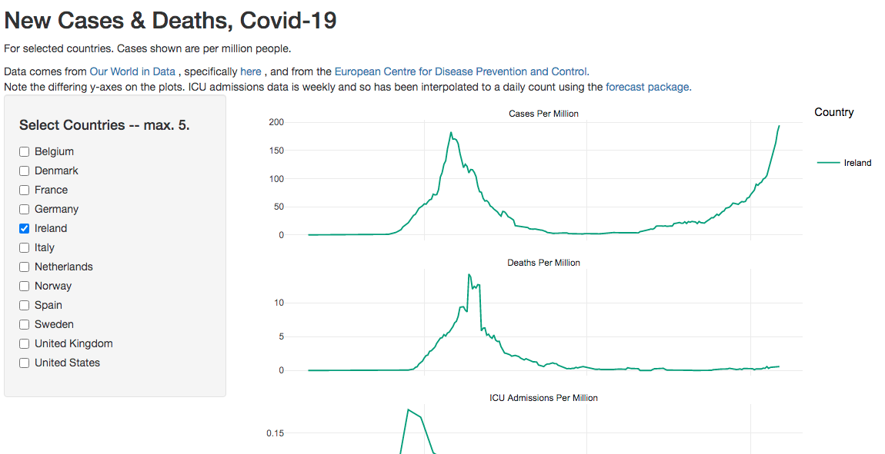

# covid_19_ireland

Shiny App on new cases and deaths. Focused on Europe and North America, particularly Ireland. It is a Progressive Web App, so you can 'add it to home screen' on Android and iPhone and get it on yer mobile. 

You can see it [here](https://robertmylesmcdonnell.shinyapps.io/covid/), it looks like this:

I made this because the Irish Government's Covid App shows a graph of cases only. I don't think that's helpful. It's better to have some context, so I have added deaths per million people and ICU admissions per million people, where available. 

I made it with R, using the [tidyverse](https://www.tidyverse.org/), [shiny](https://shiny.rstudio.com/) and [plotly](https://plotly.com/).

Data come from [Our World in Data](https://ourworldindata.org/), specifically [here](https://covid.ourworldindata.org/data/owid-covid-data.csv). 

- *Update 2020-10-17:* added ICU addmissions per 100k, from the [European Centre for Disease Prevention and Control](ttps://www.ecdc.europa.eu/en/publications-data/download-data-hospital-and-icu-admission-rates-and-current-occupancy-covid-19). These numbers are not available for all countries, and are adjusted to be _per million_ to better compare with Our World in Data's numbers, which are per million. They are also only available weekly, and so have been expanded out to a daily count using `na.interp()` from the [forecast](ttps://github.com/robjhyndman/forecast) package.  

